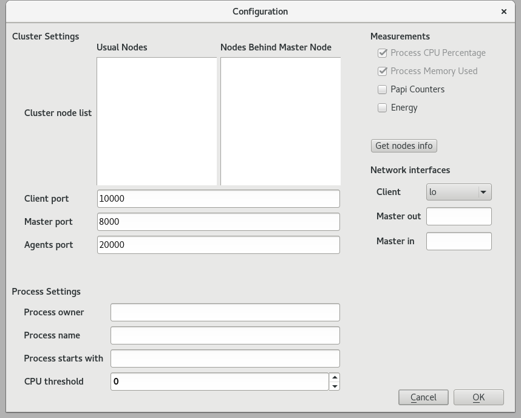

# CPM (Cluster Processes Monitor)
**CPM**, or Cluster Processes Monitor, is a tool to measure the performance of a job processes inside a computing cluster.

This tool composed by three programs:

* **MonitoringProcesses**. The client. This program runs locally in the user computer.
* **MonitoringMaster**. The daemon running in the cluster front/master node.
* **MonitoringAgent**. The daemon running in the cluster computing/worker nodes.

# What's CPM about? #
Typically, in a computing cluster, the task of monitorize a parallel job and get statictics, such as CPU consumption, used memory or other kind of data, is a tedious job that implies visualize large logs or modify the application source code. There are some solutions that monitorize all the cluster, such as [Nagios][1] or [Zabbix][2], but they monitorize the nodes total resources, and not per process of a launched job. Also [Vampir][3] exists. It is a very complete tool that allows the user to do a very deep profiling of parallel applications, but it requires to purchase a license. **CPM** allows the user to monitorize data from individual processes in real time and get plots and statictics from them in a very easy way. It is composed by three programs that communicate among each other and work togheter.

In order to explain how **CPM** works, is needed to talk about how a computing cluster typically works. In almost all the supercomputers or clusters, the user connects throught SSH to what is called the **master, login or front node**. In this master node the user can compile his/her program that uses MPI, OpenMP, Hadoop, or others. After that, the user launchs the job by using a queue system or resources manager, and after to wait for available resources, the job runs in the **worker or computing nodes**, this is, the rest of nodes in the cluster that make the real computation.

The general process of how **CPM** works can be seen at [Figure 1](#figure1).

Typically, only the master node has direct acces to the outside world (Internet). In this master node is where the **MonitoringMaster** is going to run. This daemon acts as a bridge between the computing nodes and the user PC. It is going to open a port (8000 by default) and waits for messages from **MonitoringProcesses**, this is, the client. This client is the visual program that runs in the user PC. The **MonitoringProcesses** program opens the port 10000 bu default, where it receives packages from the master node with data that contains the information from the computing nodes. In the computing nodes is where the **MonitorinsAgent** runs. This daemon opens the port 20000 by default. All these ports are configurable from the **Monitoringprocesses** graphical interface.

When the **MonitoringProcesses** client wants to start taking measures from a job, it sends a package to the **MonitoringMaster**. This daemon creates an image from itself by using the *fork()* function and listens in the port 8000 + N, where N is the number of **MonitoringMaster** processes that are already running in the master node. This forked process sends an ACK to the client. In this way, the client knows that the program is running in the master node and at wich port. After that, the client sends to this new process a package pear each one of the agents it wants to have data from, and a package to indicate that also wants data from this master node. Then, the **MonitoringMaster** sends a package to each one of the computing nodes, where the **MonitoringAgent** is running. This daemon forks and launchs a **MonitoringAgent** process in each one of the computing nodes. This forked processes are the ones that actually get the information from given processes and send it back to the **MonitoringMaster**, who is going to re-send it to the client.

## Resume ##
**MonitoringProcesses**
It is implemented in C++ using the [Qt][4] libraries. It provides a user-friendly interface to visualize the data from the cluster processes. Listen at port 10000 by default, where it receives data from **MonitoringAgent** across the **MonitoringMaster**.

**MonitoringMaster**
It is a program that runs in the cluster computing master node. It works as a bridge between the client program, and the agents running in each one of the computing nodes of the cluster. It listens at port 8000 + N.

**MonitoringAgent**
It runs in the computing nodes and is the responsible of collecting data of the processes and send them to the client by means of the **MonitoringMaster** process.

# Structure #
In this GitHub repository you can find the following directories:

* doc - Documentation.
* script - Scripts that can be used to start or stop the daemons.
* src - **CPM** source code. It includes the source of the three programs.
* build - Directory where the final compiled programs are stored. This directory is created when building the application.

# Getting started #

## Building Requirements ##
Common requirements for the three programs are a Linux 64 bit distribution. Individual requirements to build **CPM** are the next ones.

### MonitoringProcesses ###

* [Qt][4] libraries.
* C++11.
* [libssh][5].

### MonitoringMaster ###

* C++11.

### MonitoringAgent ###

* *procps* development libraries. In Debian, *libprocps4-dev*, in CentOs, *procps-devel.x86_64*.
* [PAPI][6] library.
* C++11.

## Building
The default way to build **CPM** is:

	git clone https://github.com/jmabuin/CPM.git
	cd CPM
	make

This will create the *build* folder, which will contain three files:

* **MonitoringAgent**
* **MonitoringMaster**
* **MonitoringProcesses**

# Configuring CPM #

There are some parameters that the user needs to configure in order to execute **CPM** in a correct way. These are parameters regarding your cluster network configuration and ports to be used to communicate between the three programs.

To configure **CPM** open the **MonitoringProcesses** program and then click on *File* and *Configure program...*. The configuration window will appear as showed in [Figure 2](#figure2)

This window have the following configuration parameters:

###**Cluster settings**###
**Usual Nodes**: This is where we have to write the master node name, for example: *masternode.domain.com*

**Nodes Behind Master Node**: This is where we have to write the computing node names, one per line. Typically, this names are in the master node */etc/hosts* file. For example, in a hadoop cluster, the content could be:

    hadoop2
    hadoop3
    hadoop4
    hadoop5

**Client Port**: This is where we can insert or change the port where the **MonitoringProcesses** application will listen and wait for data packages. The default is 10000.

**Master Port**: Port where the **MonitoringMaster** application will listen for incoming packages. Default: 8000.

**Agents Port**: Port where the agent daemon will listen for incoming packages requesting information for processes. Default: 20000.

**IMPORTANT**: The ports configuration only works if the user uses the Deploy mode. Otherwise, the ports need to be specified when launching the **MonitoringMaster** and **MonitoringAgents** applications.

###**Measurements**###

Here the user can configure what data he/she wants to aquire from the processes running in the cluser. By default, CPU Percentage and memory are measured. Also, PAPI counters can be measured. For now, only the PAPI_L1_DCM, PAPI_L2_DCM and PAPI_TOT_INS are measured. Energy can also be measured if the CPUs in the computing nodes have the [Intel RAPL Registers](http://icl.cs.utk.edu/projects/papi/wiki/PAPITopics:RAPL_Access) enabled.

###**Network Interfaces**###

This configuration will only work if we use the deploy mode.

**Client**: The network interface to use in the **MonitoringProcesses** application.

**Master out**: It is usual that the master node have more than one network interface. One to communicate with the outside work and other for the internal network that communicates with the computing nodes. In this field we need to write the network interface that the master node uses to communicate with the internet. Default: eth0.

**Master in**: In this field we need to write the network interface that the master node uses to communicate with the internal network. Default: eth0.

###**Process Settings**###

Here we will insert the characteristics of the process that we want to gather information.

**Process owner**: The user that owns the process we want to monitorize.

**Process name**: Part of the name of the process we want to monitorize. It can be a string in the middle of the process name.

**Process starts with**: A string that indicates the beginning of the process name we are looking for

**CPU threshold**: The agents will only look for processes above this CPU percentage. (Default: 0)

# Deploying CPM #

Since version 0.3.0, the **MonitoringProcesses** program includes the option to deploy the tool in our computing cluster. To use this option, requirements are:

* Have SSH access to the cluster master node (for now only with username - password).
* From the master to the computing nodes, passwordless SSH access, this is, with public - private key.
* In the computing nodes, the libraries needed to build **MonitoringAgent**. In the master node, libraries needed to build **MonitoringMaster** and **MonitoringAgent**.

If the user environment comply with this requirements, the deploy option can be used.

## Deploy configuration ##

To configure the deploy mode, go to `File -> Manage cluster...`. You should see a screen as in [Figure 3](#figure3)

This window have the following configuration parameters:

###**SSH Connection settings**###
**Username**: Username to connect with master and computing nodes.

**Password**: Password to connect with master node.

**SSH port**: Port to use when SSH into master node. Default: 22.

**SSH internal port**: Port to use when SSH from master into computing nodes. Default: 22.

**Key file**: For its use in future versions and SSH into all nodes without password.

**Prefered connection method**: Here the user can choose to use a username - password authentication or use the key file. For now, only the username - password works.

###**Actions**###

Here is where the deploy actions will take place. There are four possible actions:

* **Deploy**: Distributes the tool among the nodes and build it. First, if a previous version exists, this action will delete it.
* **Run**: Executes the necessary tools (*MonitoringMaster* and *MonitoringAgent*) with the correct configuration in order to have **CPM** running in our cluster.
* **Stop**: Stop the *MonitoringMaster* and *MonitoringAgent* processes launched with the *Run* action.
* **Check**: Check if the processes *MonitoringMaster* and *MonitoringAgent* are running in our cluster.

###**Locations**###

The precious Actions can take place in different locations:

* **Agents**: The computing nodes.
* **Master**: The master node.
* **All**: All the nodes.

## Deploying manually ##
It is also possible to deploy the tool manually. In each one of the cluster computing node the **MonitoringAgent** has to be running. For that, in each one of these nodes, the user has to execute `./MonitoringAgent`. In the master node, the **MonitoringAgent** and the **MonitoringMaster** have to be running. In the case of the Agent, the command is the same. For the Master the command is `./MonitoringMaster`. And finally, in the user's PC, the command to execute is `./MonitoringProcesses`. This last command will open the graphic interface made with [Qt][4].

##Configuring the MonitoringMaster program##

If we execute the **MonitoringMaster** program with the `-h` parameter, we will see all the available options.

    $ ./MonitoringMaster  -h

    Program: MonitoringMaster (Monitor to bridge cluster master node and computing nodes)
    Version: 0.3.0
    Contact: José M. Abuín <xxxxxxxx@usc.es>

    Usage:   MonitoringMaster [options]

    Common options:

     -d		Debug mode. Default: False.
     -h		Print this help.

    Network options:

     -a INT        Port where the agent is going to run in the computing nodes. Default: 20000.
     -m INT        Port where the master monitor (this program) is going to run master node. Default: 8000.
     -c INT        Port where the client program is going to run. Default: 10000.
     -o STR        Network interface that communicates the master node with the outside world. Default: eth0.
     -i STR        Network interface internal to the cluster. Default: eth0.

These options are useful if we do not want to use the deploy mode. In the deploy mode, these configuration parameters are set automatically.

##Configuring the MonitoringAgent program##

If we execute the **MonitoringAgent** program with the `-h` parameter, we will see all the available options.

    $ ./MonitoringAgent  -h

    Program: MonitoringAgent (Monitor to processes information in the computing nodes)
    Version: 0.3.0
    Contact: José M. Abuín <xxxxxxxx@usc.es>

    Usage:   MonitoringAgent [options]

    Common options:

     -d		Debug mode. Default: False.
     -h		Print this help.

    Network options:

     -a INT        Port where the agent (this program) is going to run in the computing nodes. Default: 20000.

These options are useful if we do not want to use the deploy mode. In the deploy mode, these configuration parameters are set automatically.

##Tasks

###Completed

- [x] Creation of the three programs.
- [x] Creation of init and stop scripts.
- [x] Creation of a **Debug mode** to see logs from agents in the screen instead of the system logs.
- [x] Creation of a **Deploy** function to deploy the agents to the master and computing nodes and build them.
- [x] Creation of a **Start** function to start master and agents remotely from the client.

###To Do

- [ ] Creation of install target in Makefile.
- [ ] Improve the ports assignation to forked processes.

##Frequently asked questions (FAQs)

1. [I can not build the tool because I can not find the procps library.](#building1)

####1. I can not build the tool because I can not find the procps library.
Depending on the Linux distribution the name of the library can change. For example, in Debian the library is linked with the *-lprocps* argument, and in CentOs with *-lproc* argument. Check in your library folder for the libproc library and link it properly in your Makefile.

[1]: https://www.nagios.org/
[2]: http://www.zabbix.com/
[3]: https://www.vampir.eu/
[4]: http://www.qt.io/
[5]: https://www.libssh.org/
[6]: http://icl.cs.utk.edu/papi/